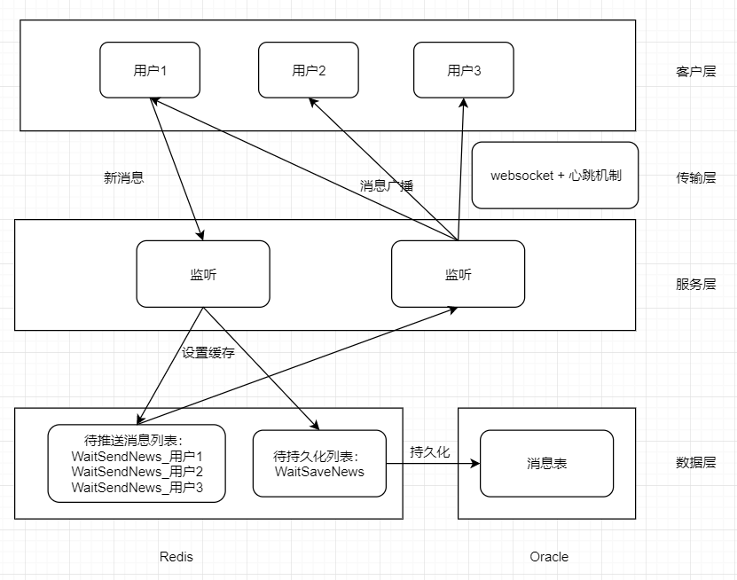

# 即时通讯方案：websocket + 心跳机制实现长连接 & redis缓存

## 设计方案


## 生产环境部署
依赖
``` 
pip install django-redis
pip install dwebsocket
```
django-settings.py
``` 
# dwebsocket
# 1. 生产环境需要打开
# 2. 开发环境有两种方式：1）注释不使用 2）使用命令启动：
# uwsgi --http :8080 --http-websockets --processes 1 --wsgi-file wsgi.py--async 30 --ugreen --http-timeout 300
# WEBSOCKET_FACTORY_CLASS = 'dwebsocket.backends.uwsgi.factory.uWsgiWebSocketFactory'
```

nginx
``` 
# 使用http1.1
           proxy_redirect off;
            proxy_http_version 1.1;
            proxy_set_header Upgrade $http_upgrade;
            proxy_set_header Connection "Upgrade";
# 超时设置
           proxy_connect_timeout 60;
           proxy_read_timeout 600;
           proxy_send_timeout 600;
```
uwsgi
``` 
# 设置socket权限
http-websockets=true
processes=4  # 根据服务器核数情况配置，一般比服务器核数低点
async=60  # 每个进程中跑多少线程
ugreen=''
# 响应时间
http-timeout=600
socket-timeout=600
harakiri=600
```

## 后端 基于django
``` 
import json
import time
import json
import pickle
import copy

from utils.format_data import ReturnDataApi
from dwebsocket.decorators import accept_websocket, require_websocket
from django_redis import get_redis_connection
from django.core.cache import cache

from . import models as all_models
from utils.exceptions import logger_chat


class WsConnection(object):
    """
    ws连接工具类 + 心跳封装

    使用时，只需对 on_listen、on_receive 重写或传入callback函数

    前后端交互数据固定格式：{"code": 200, "msg": "success", "data": "Hello server."}

    @listen_interval 监听时间间隔
    @heart_check_interval  前端心跳应答时间
    """

    def __init__(
        self,
        ws,
        listen_interval=200,
        heart_check_interval=20 * 1000,
        on_listen=None,
        on_receive=None,
    ):

        self.ws = ws
        self.listen_interval = listen_interval/1000
        self.heart_check_interval = heart_check_interval
        self.last_check_time = int(time.time() * 1000)

        self._on_listen = on_listen
        self._on_receive = on_receive

    def start_listen(self):
        while True:
            time.sleep(self.listen_interval)
            # 客户端超过时间无心跳信息，自动断开
            if int(time.time()) - self.last_check_time > self.heart_check_interval:
                self.close()
                break

            if not self.ws.is_closed():
                self.on_listen()
                if self.ws.has_messages():
                    self._read()
            else:
                self.close()
                break

    def on_listen(self):
        """循环期间想要做的事情"""
        if self._on_listen:
            self._on_listen()

    def on_receive(self, data):
        """接收到信息时想要做的事情"""
        if self._on_receive:
            self._on_receive(data)

    def _read(self):
        receive = self.ws.read()
        if receive:
            receive = receive.decode("utf-8")
            print(receive)
            self.last_check_time = int(time.time() * 1000)
            if receive == "ping":
                self.ws.send("pong".encode('utf-8'))
            else:
                try:
                    _data = json.loads(receive)
                except Exception as error:
                    raise ValueError("""
                    except message format: {"code": 200, "msg": "success", "data": "Hello server."}
                    """)

                self.on_receive(_data)

    def send(self, data=None, code=200, msg=""):
        send_str = json.dumps({
            "code": code,
            "msg": msg,
            "data": data
        })
        self.ws.send(send_str.encode('utf-8'))

    def close(self):
        self.ws.close()


class RedisList(object):
    """
    redis list数据结构使用封装
    数据存储格式pickle(不可见)

    expire_time 过期时间，默认三个月
    """

    def __init__(self, redis_con, expire_time=60*60*24*30*3):

        self.redis_con = redis_con
        self.expire_time = expire_time

    def h_add_field(self, key, field, value):
        """哈希增加字段"""
        with cache.lock(key):
            self.redis_con.hset(key, field, pickle.dumps(value))
            self.redis_con.expire(key, self.expire_time)  # 更新过期时间

    def h_del_fields(self, key, fields):
        """哈希删除字段，列表"""
        for field in fields:
            self.h_del_field(key, field)

    def h_del_field(self, key, field):
        """哈希删除字段列表，单个"""
        if self.redis_con.hexists(key, field):
            with cache.lock(key):
                res = self.redis_con.hdel(key, field)
        else:
            res = True

        return res

    def h_get_all_fields(self, key):
        _fields = self.redis_con.hgetall(key)

        fields = {}
        for key, value in _fields.items():
            fields[key.decode('utf8')] = pickle.loads(value)

        return fields

    def check_key(self, key):
        return self.redis_con.exists(key)


class WsView(WsConnection):
    """
    聊天视图
    on_listen 监听过程中执行的动作
    on_receive 长连接交互

    前后端交互数据固定格式：{"code": 200, "msg": "success", "data": "Hello server."}
    """

    def __init__(
        self,
        ws,
        listen_interval=200,
        heart_check_interval=20 * 1000,
        on_listen=None,
        on_receive=None,
    ):
        super(WsView, self).__init__(
            ws=ws,
            listen_interval=listen_interval,
            heart_check_interval=heart_check_interval,
            on_listen=on_listen,
            on_receive=on_receive,
        )

        self.redis_cursor = RedisList(get_redis_connection("default"))
        self.current_user = None
        self.WaitSendNews_key = None
        self.sending_news = []
        self.chat_users = {}

    def on_listen(self):
        if not self.current_user:
            self.send(code=231, msg="申请初始化当前用户")
            time.sleep(2)

        elif self.redis_cursor.check_key(self.WaitSendNews_key):
            wait_sending_news = {}
            redis_news = self.redis_cursor.h_get_all_fields(self.WaitSendNews_key)
            for key, value in redis_news.items():
                if key not in self.sending_news:
                    wait_sending_news[key] = value
                    self.sending_news.append(key)

            if wait_sending_news:
                self.send(code=236, msg="接收到新消息", data=wait_sending_news)

    def on_receive(self, res):
        """
        code :
            230 初始化当前用户
            231 申请初始化当前用户[后端发起指令]
            234 发送消息
            235 信息发送成功 return data => {"send_id": "1313_3781971384", "msg": "成功"}
            236 接收到新消息
            237 删除缓存[前端发起指令]

            300 信息推送出现异常 return data => {"send_id": "1313_3781971384", "msg": "失败原因"}
        """
        # 初始化当前用户
        if res.get("code") == 230:
            self.current_user = res.get("data")
            self.WaitSendNews_key = "WaitSendNews_" + str(self.current_user)

        # 广播新消息
        elif res.get("code") == 234:
            news_info = res.get("data")
            chat_id = news_info.get("chat_id")
            send_id = news_info["send_id"]

            try:
                users = copy.deepcopy(self.chat_users.get(chat_id))
                if not users:
                    users = list(all_models.ChatList.users.through.objects.
                                 filter(chat_id=news_info.get("chat_id")).values_list("user_id", flat=True))
                    self.chat_users[chat_id] = copy.deepcopy(users)

                for receive_user in users:
                    news_info["send_user_id"] = self.current_user
                    news_info["receive_user_id"] = receive_user
                    self.redis_cursor.h_add_field(
                        key="WaitSendNews_" + str(receive_user),
                        field=send_id,
                        value=news_info,
                    )

                self.send(code=235, msg="信息发送成功",
                          data={"send_id": send_id, "msg": "成功"})

            except Exception as error:
                logger_chat.error("信息发送出现异常" + str(error))
                self.send(code=300, msg="信息发送出现异常",
                          data={"send_id": send_id, "msg": str(error)})

        # 清除缓存
        elif res.get("code") == 237:
            wait_del_fields = res.get("data")
            for field in wait_del_fields:
                if self.redis_cursor.h_del_field(self.WaitSendNews_key, field):
                    self.sending_news.remove(field)


@require_websocket
def chat_websocket(request):
    # ws_conn = WsView(ws=request.websocket)
    # ws_conn.start_listen()
    try:
        ws_conn = WsView(ws=request.websocket)
        ws_conn.start_listen()

    except Exception as error:
        # 记录一下异常，继续抛出
        logger_chat.error("长连接运行中出现BUG：" + str(error))
        raise error
```

## 前端
### ws.js-websocket封装 
``` 
// 封装WebSocket
export function WsConnect(url){
    this.url = url.replace(/http/g, 'ws')
    this.ws = null
    this.lockReconnect = false
    this.is_listen = true

    // 心跳
    this.heart_check_time = 5 * 1000  // 心跳间隔默认5s一个心跳
    this.reconnect_time = 20 * 1000  // 服务器应答时间，默认20s
    this.checkTimeout = null
    this.serverTimeout = null

    this.sendMessage = function(data, code=200, msg=""){
        this.ws.send(JSON.stringify({
            "code": code, 
            "msg": msg, 
            "data": data
        }))
    }
    // 回调函数
    this.onopen = function(event){
        // console.log("开启长连接")
    }
    this.onmessage = function(res){
        // console.log("收到消息")
        // console.log(res["data"])
    }
    this.onclose = function(event){
        // console.log("关闭长连接")
    }
    this.onerror = function(event){
        // console.log("出现错误")
    }

    this.createWS = function(){
        if(typeof WebSocket != 'undefined'){
            this.ws = new WebSocket(this.url);
            this.initEventHandle()
        }else{
            // this.$message.error('当前浏览器不支持WebSocket，请更换浏览器')
            console.log("当前浏览器不支持WebSocket，请更换浏览器")
        }
    }
    this.closeConnect = function(){
        this.is_listen = false
        this.ws.close()
    }
    this.reconnect = function(){
        if(this.lockReconnect) return
        this.lockReconnect = true
        var _this = this
        setTimeout(function () {     
            _this.createWS()
            _this.lockReconnect = false;
        }, 1000*2)
    }
    this.startHeartCheck = function(){  // 心跳核心
        var _this = this
        _this.checkTimeout = setTimeout(function(){
            if(_this.ws.readyState==1){
                _this.ws.send("ping")
                _this.serverTimeout = setTimeout(function(){
                    _this.reconnect()
                }, _this.reconnect_time)
            }
        }, _this.heart_check_time)
    }
    this.resetHeartCheck = function(){  // 重启心跳
        if(this.checkTimeout){ window.clearTimeout(this.checkTimeout) }
        if(this.serverTimeout){ window.clearTimeout(this.serverTimeout) }
        this.startHeartCheck()
    }

    this.initEventHandle = function(){  // 绑定事件
        if(this.checkTimeout){ window.clearTimeout(this.checkTimeout) }
        if(this.serverTimeout){ window.clearTimeout(this.serverTimeout) }

        var _this = this

        this.ws.onopen = function(event){
            _this.resetHeartCheck()
            _this.onopen(event)
        }

        this.ws.onmessage = function(event){
            _this.resetHeartCheck()
            if(event.data != 'pong'){
                // 接收到回应之外的数据
                _this.onmessage(JSON.parse(event.data))
            }
        }

        this.ws.onclose = function(event){
            if(_this.is_listen){
                // 不明原因关闭，重连
                _this.reconnect()
            }else{
                _this.onclose(event)
            }
        }

        this.ws.onerror = function(event) {
            // 不是客户端主动关闭，重新连接
            _this.reconnect()
            _this.onerror(event)
        }
    }
}


// export default {
//     WsConnect,
// }
```

### 使用示例-基于vue
``` 
<template>
<div>
    <div>
        <div v-for="(item, key) in news_list" :key="key">
            <span>{{item.send_user_id}} 说：{{item.content}}</span>
        </div>
    </div>
    <el-input v-model="msg"  style="width:200px"></el-input>
    <el-button @click="sendMessage()">发送</el-button>
</div>
</template>
 
<script>
export default {
    data(){
        return{
            msg: "",
            ws_con: true,

            news_list: {},
            current_user:"",

        }
    },
    created(){
        this.current_user = this.$route.query.current_user
        console.log(this.current_user)
        var _this = this
        this.ws_connect = new this.$WsConnect(
            this.$path+"chat/chat_websocket/"
        )

        this.ws_connect.onopen = function(event){
            // 初始化当前用户[可以不做，由后端申请初始化]
            // _this.ws_connect.sendMessage(_this.current_user, 230, "初始化当前用户")
            console.log("开启长连接")
        }
        this.ws_connect.onmessage = function(res){
            // 231 申请初始化当前用户[后端发起指令]
            if(res["code"] == 231){
                _this.ws_connect.sendMessage(_this.current_user, 230, "初始化当前用户")

            // 235 信息发送成功 return data => {"send_id": "1313_3781971384", "msg": "成功"}
            }else if(res["code"] == 235){
                // console.log(res["data"])

            // 300 信息发送失败 return data => {"send_id": "1313_3781971384", "msg": "失败原因"}
            }else if(res["code"] == 300){
                // console.log(res["data"])

            // 236 接收到新消息
            }else if(res["code"] == 236){
                var new_keys = []
                for(var key in res["data"]){
                    new_keys.push(key)
                    _this.$set(_this.news_list, key, res["data"][key])
                }
                // 解决页面不刷新问题
                _this.ws_connect.sendMessage(new_keys, 237, "删除缓存[前端发起指令]")
                console.log(_this.news_list)
            }
        }
        this.ws_connect.onclose = function(event){
            console.log("关闭长连接")
        }
        this.ws_connect.onerror = function(event){
            console.log("出现错误")
        }

        this.ws_connect.createWS()
    },
    activated(){
    },
    mounted() {
    },
    watch:{
    },
    destroyed(){
        this.ws_connect.closeConnect()
    },
    methods: {
        sendMessage(){
            var chat_id = "21"
            var send_timestamp = new Date().getTime()
            var news_info = {
                "send_id": chat_id + "_" + send_timestamp,
                "send_timestamp": send_timestamp,

                "chat_id": chat_id,
                "new_type": 1, 
                "content": this.msg, 
                "resource_url": "", 
            }

            this.ws_connect.sendMessage(news_info, 234, "发送消息")
            this.msg = ""
        },
    },
}
</script>


<style scoped>

</style>

```


