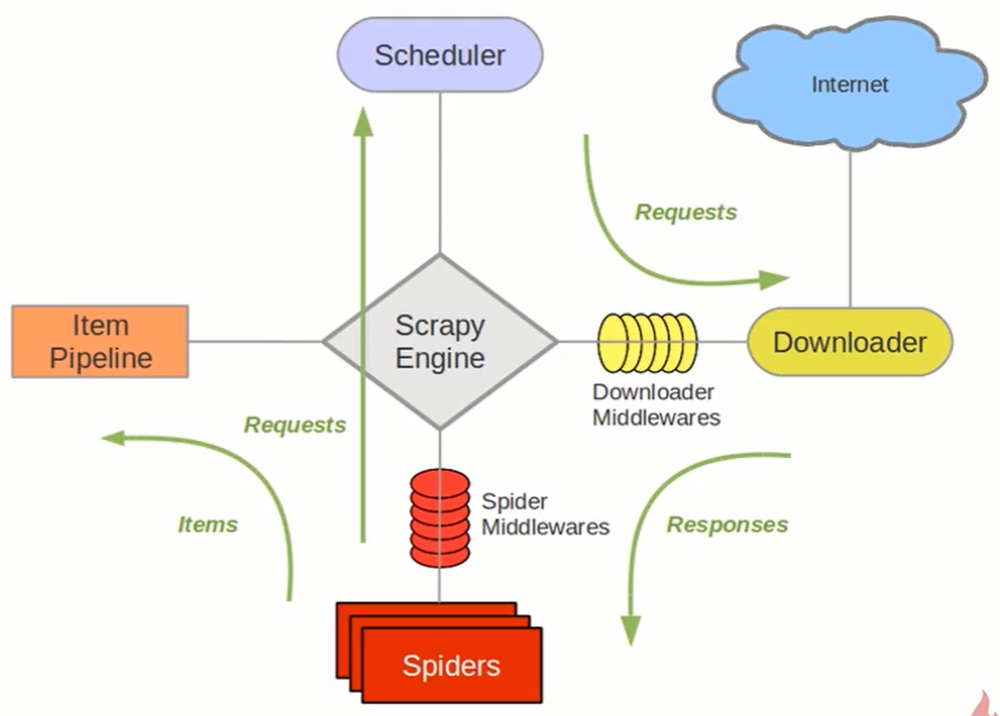

# 爬虫框架Scrapy入门与实践
基于Twisted的异步处理框架，省去很多造轮子的麻烦。架构如下：


[官方文档](https://scrapy-chs.readthedocs.io/zh_CN/latest/)

## 常用命令
``` 
# 创建项目
scrapy startproject tutorial

# 创建爬虫应用
scrapy genspider mydomain mydomain.com

# 运行爬虫，spiders文件夹下
scrapy crawl douban

# 运行爬虫并保存数据，spiders文件夹下
scrapy crawl douban -o test.csv
scrapy crawl douban -o test.json

```

## 代码运行
创建server.py，写入：
``` 
from scrapy import cmdline

cmdline.execute("scray crawl douban".split())
```
运行`python server.py`

## 爬虫伪装
+ user-agent中间件

middlewares.py
``` 
import random

class MyUseragent(object):
    """
    useragent 中间件编写
    """
    def process_request(self, request, spider):
        MY_USER_AGENT = [
            "Mozilla/4.0 (compatible; MSIE 6.0; Windows NT 5.1; SV1; AcooBrowser; .NET CLR 1.1.4322; .NET CLR 2.0.50727)",
            "Mozilla/4.0 (compatible; MSIE 7.0; Windows NT 6.0; Acoo Browser; SLCC1; .NET CLR 2.0.50727; Media Center PC 5.0; .NET CLR 3.0.04506)",
            "Mozilla/4.0 (compatible; MSIE 7.0; AOL 9.5; AOLBuild 4337.35; Windows NT 5.1; .NET CLR 1.1.4322; .NET CLR 2.0.50727)",
            "Mozilla/5.0 (Windows; U; MSIE 9.0; Windows NT 9.0; en-US)",
            "Mozilla/5.0 (compatible; MSIE 9.0; Windows NT 6.1; Win64; x64; Trident/5.0; .NET CLR 3.5.30729; .NET CLR 3.0.30729; .NET CLR 2.0.50727; Media Center PC 6.0)",
            "Mozilla/5.0 (compatible; MSIE 8.0; Windows NT 6.0; Trident/4.0; WOW64; Trident/4.0; SLCC2; .NET CLR 2.0.50727; .NET CLR 3.5.30729; .NET CLR 3.0.30729; .NET CLR 1.0.3705; .NET CLR 1.1.4322)",
            "Mozilla/4.0 (compatible; MSIE 7.0b; Windows NT 5.2; .NET CLR 1.1.4322; .NET CLR 2.0.50727; InfoPath.2; .NET CLR 3.0.04506.30)",
            "Mozilla/5.0 (Windows; U; Windows NT 5.1; zh-CN) AppleWebKit/523.15 (KHTML, like Gecko, Safari/419.3) Arora/0.3 (Change: 287 c9dfb30)",
            "Mozilla/5.0 (X11; U; Linux; en-US) AppleWebKit/527+ (KHTML, like Gecko, Safari/419.3) Arora/0.6",
            "Mozilla/5.0 (Windows; U; Windows NT 5.1; en-US; rv:1.8.1.2pre) Gecko/20070215 K-Ninja/2.1.1",
            "Mozilla/5.0 (Windows; U; Windows NT 5.1; zh-CN; rv:1.9) Gecko/20080705 Firefox/3.0 Kapiko/3.0",
        ]
        agent = random.choice(MY_USER_AGENT)

        request.headers["User_Agent"] = agent
```
settings.py
``` 
# Enable or disable downloader middlewares
# See https://docs.scrapy.org/en/latest/topics/downloader-middleware.html
DOWNLOADER_MIDDLEWARES = {
   # 'tutorial.middlewares.TutorialDownloaderMiddleware': 543,
    'tutorial.middlewares.MyUseragent': 543,
}
```

+ ip代理中间件伪装

类似方法，搜索一下

## [一个示例：爬取豆瓣排名前250的电影](./tutorial)