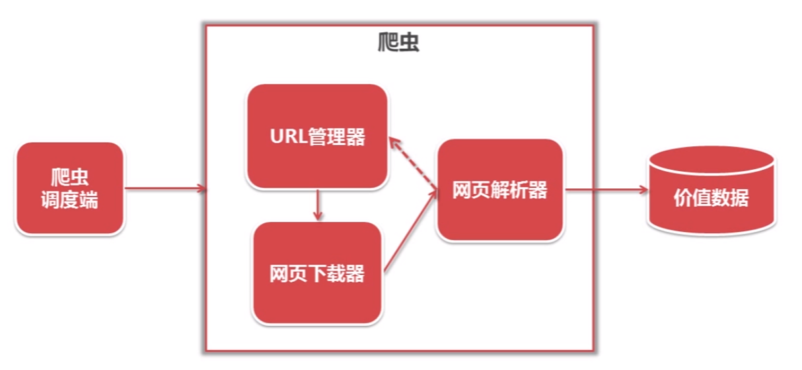

# 一个简单的爬虫架构



+ 爬虫调度端：运行和监控
+ URL解析器：管理待抓取和已抓取url集合
+ 网页下载器：将url对应网页下载到本地
+ 网页解析器：从页面中提取出有价值数据
+ 价值数据：使用/展示

## URL解析器
+ 目的：防止重复/循环抓取
+ 实现方式
    + python 内存：
        + 带爬取url集合：set()
        + 已爬取url集合：set()
    + 关系数据库，MySql/mongodb
        + urls(url, is_crawled)
    + 缓存数据库 redis
        + 带爬取url集合：set()
        + 已爬取url集合：set()

## 网页下载器
+ urlib2 官方基础模块
+ requests 第三方强大包

## 网页解析器
+ 模糊匹配：正则表达式
+ 结构化解析，DOM树（ Mocument Object Model）
    + html.parser
    + lxml
    + Beautiful Soup：可以同时使用上面两种，更为强大
    
## 一个例子：爬取 百度百科 量化 字条相关1000个网页 
Tree:
``` 
spider_main.py             # 爬虫调度端/程序入口文件
url_manager.py             # URL解析器
html_downloader.py         # 网页下载器
html_parser.py             # 网页解析器
html_outputer.py           # 最终数据处理：可以保存csv/数据库
```

[地址](.//)
