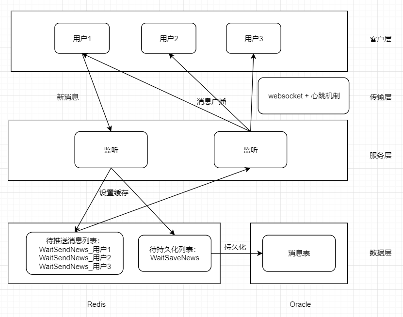

# 即时通讯方案：websocket + 心跳机制实现长连接 & redis缓存

## 设计方案


## 生产环境部署
依赖
``` 
pip install django-redis
pip install dwebsocket
```
django-settings.py
``` 
# dwebsocket
# 1. 生产环境需要打开
# 2. 开发环境有两种方式：1）注释不使用 2）使用命令启动：
# uwsgi --http :8080 --http-websockets --processes 1 --wsgi-file wsgi.py--async 30 --ugreen --http-timeout 300
# WEBSOCKET_FACTORY_CLASS = 'dwebsocket.backends.uwsgi.factory.uWsgiWebSocketFactory'
```

nginx
``` 
# 使用http1.1
           proxy_redirect off;
            proxy_http_version 1.1;
            proxy_set_header Upgrade $http_upgrade;
            proxy_set_header Connection "Upgrade";
# 超时设置
           proxy_connect_timeout 60;
           proxy_read_timeout 600;
           proxy_send_timeout 600;
```
uwsgi
``` 
# 设置socket权限
http-websockets=true
processes=4
async=60
ugreen=''
# 响应时间
http-timeout=600
socket-timeout=600
harakiri=600
```

## 后端 基于django
``` 
import json
import time
import json
import pickle

from utils.format_data import ReturnDataApi
from dwebsocket.decorators import accept_websocket, require_websocket
from django_redis import get_redis_connection
from django.core.cache import cache


class WsConnection(object):
    """
    ws连接工具类 + 心跳封装

    使用时，只需对 on_listen、on_receive 重写或传入callback函数

    前后端交互数据固定格式：{"code": 200, "msg": "success", "data": "Hello server."}
    """

    def __init__(
        self,
        ws,
        listen_interval=1000,
        heart_check_interval=4000,
        on_listen=None,
        on_receive=None,
    ):

        self.ws = ws
        self.listen_interval = listen_interval
        self.heart_check_interval = heart_check_interval
        self.last_check_time = int(time.time() * 1000)

        self._on_listen = on_listen
        self._on_receive = on_receive

    def start_listen(self):
        while True:
            time.sleep(self.listen_interval/1000)
            # 客户端超过时间无心跳信息，自动断开
            if int(time.time()) - self.last_check_time > self.heart_check_interval:
                self.close()
                break

            if not self.ws.is_closed():
                self.on_listen()
                if self.ws.has_messages():
                    self._read()
            else:
                self.close()
                break

    def on_listen(self):
        """循环期间想要做的事情"""
        if self._on_listen:
            self._on_listen()

    def on_receive(self, data):
        """接收到信息时想要做的事情"""
        if self._on_receive:
            self._on_receive(data)

    def _read(self):
        self.last_check_time = int(time.time() * 1000)

        receive = self.ws.read().decode("utf-8")
        if receive == "ping":
            self.ws.send("pong".encode('utf-8'))
        else:
            try:
                _data = json.loads(receive)
            except Exception as error:
                raise ValueError("""
                except message format: {"code": 200, "msg": "success", "data": "Hello server."}
                """)

            self.on_receive(_data)

    def send(self, data=None, code=200, msg=""):
        send_str = json.dumps({
            "code": code,
            "msg": msg,
            "data": data
        })
        self.ws.send(send_str.encode('utf-8'))

    def close(self):
        self.ws.close()


class RedisList(object):
    """
    redis list数据结构使用封装
    数据存储格式pickle(不可见)
    """

    def __init__(self, redis_con, expire_time=60*60*24*3):

        self.redis_con = redis_con
        self.expire_time = expire_time

    def add_item(self, key, data):
        # 分布式锁
        with cache.lock(key):
            pickle_str = pickle.dumps(data)
            result = self.redis_con.rpush(key, pickle_str)
            # 更新过期时间
            self.redis_con.expire(key, self.expire_time)

        return result

    def fetch_all(self, key):
        news_list_pickle = self.redis_con.lrange(key, 0, -1)
        news_list = [pickle.loads(i) for i in news_list_pickle]

        return news_list

    def delete(self, key):
        with cache.lock(key):
            result = self.redis_con.delete(key)

        return result

    def delete_range(self, key, start, end=-1):
        """删除范围值"""
        with cache.lock(key):
            result = self.redis_con.lrem(key, start, end)

        return result

    def check_key(self, key):

        return self.redis_con.exists(key)


class WsView(WsConnection):
    """
    聊天视图
    on_listen 监听过程中执行的动作
    on_receive 长连接交互

    前后端交互数据固定格式：{"code": 200, "msg": "success", "data": "Hello server."}
    """

    def __init__(
        self,
        ws,
        listen_interval=1000,
        heart_check_interval=4000,
        on_listen=None,
        on_receive=None,
    ):
        super(WsView, self).__init__(
            ws=ws,
            listen_interval=listen_interval,
            heart_check_interval=heart_check_interval,
            on_listen=on_listen,
            on_receive=on_receive,
        )

        self.redis_con = RedisList(get_redis_connection("default"))
        self.current_user = None
        self.WaitSendNews_key = None
        self.lock_news_length = 0

    def on_listen(self):
        if self.current_user is None:
            self.send(code=231, msg="申请初始化当前用户")

        elif self.redis_con.check_key(self.WaitSendNews_key):
            news_list = self.redis_con.fetch_all(self.WaitSendNews_key)
            send_news_list = news_list[self.lock_news_length:]

            if len(send_news_list) > 0:
                self.send(code=236, msg="接收到新消息", data=send_news_list)
                self.lock_news_length += len(send_news_list)

    def on_receive(self, res):
        """
        code :
            230 初始化当前用户
            231 申请初始化当前用户[后端发起指令]
            234 发送消息
            235 信息发送成功
            236 接收到新消息
            237 删除缓存[前端发起指令]
        """
        if res.get("code") == 230:
            self.current_user = res.get("data")
            self.WaitSendNews_key = "WaitSendNews_" + str(self.current_user)

        elif res.get("code") == 234:
            now_timestamp = int(round(time.time() * 1000))

            news_info = res.get("data")
            news_info["new_id"] = str(news_info["chat_id"]) + "_" + str(now_timestamp)

            for receive_user in news_info["receive_users"]:
                self.redis_con.add_item("WaitSendNews_" + str(receive_user), news_info)

            self.send(code=235, msg="信息发送成功", data=news_info)

        elif res.get("code") == 237:
            delete_length = res.get("data")
            news_list = self.redis_con.fetch_all(self.WaitSendNews_key)
            if len(news_list) == delete_length:
                if self.redis_con.delete(self.WaitSendNews_key):
                    self.lock_news_length = 0
            else:
                if self.redis_con.delete_range(key=self.WaitSendNews_key, start=delete_length+1):
                    self.lock_news_length -= delete_length


@require_websocket
def test_websocket(request):
    print("启动websocket")

    ws_conn = WsView(ws=request.websocket, listen_interval=100)

    ws_conn.start_listen()
```

## 前端
### ws.js-websocket封装 
``` 
// 封装WebSocket
export function WsConnect(url){
    this.url = url.replace(/http/g, 'ws')
    this.ws = null
    this.lockReconnect = false
    this.is_listen = true

    // 心跳
    this.heart_check_time = 3 * 1000  // 心跳间隔
    this.reconnect_time = 3 * 1000  // 服务器应答时间
    this.checkTimeout = null
    this.serverTimeout = null

    this.sendMessage = function(data, code=200, msg=""){
        this.ws.send(JSON.stringify({
            "code": code, 
            "msg": msg, 
            "data": data
        }))
    }
    // 回调函数
    this.onopen = function(event){
        // console.log("开启长连接")
    }
    this.onmessage = function(res){
        // console.log("收到消息")
        // console.log(res["data"])
    }
    this.onclose = function(event){
        // console.log("关闭长连接")
    }
    this.onerror = function(event){
        // console.log("出现错误")
    }

    this.createWS = function(){
        if(typeof WebSocket != 'undefined'){
            this.ws = new WebSocket(this.url);
            this.initEventHandle()
        }else{
            // this.$message.error('当前浏览器不支持WebSocket，请更换浏览器')
            console.log("当前浏览器不支持WebSocket，请更换浏览器")
        }
    }
    this.closeConnect = function(){
        this.is_listen = false
        this.ws.close()
    }
    this.reconnect = function(){
        if(this.lockReconnect) return
        this.lockReconnect = true
        var _this = this
        setTimeout(function () {     
            _this.createWS()
            _this.lockReconnect = false;
        }, 1000*2)
    }
    this.startHeartCheck = function(){  // 心跳核心
        var _this = this
        _this.checkTimeout = setTimeout(function(){
            if(_this.ws.readyState==1){
                _this.ws.send("ping")
                _this.serverTimeout = setTimeout(function(){
                    _this.reconnect()
                }, _this.reconnect_time)
            }
        }, _this.heart_check_time)
    }
    this.resetHeartCheck = function(){  // 重启心跳
        if(this.checkTimeout){ window.clearTimeout(this.checkTimeout) }
        if(this.serverTimeout){ window.clearTimeout(this.serverTimeout) }
        this.startHeartCheck()
    }

    this.initEventHandle = function(){  // 绑定事件
        if(this.checkTimeout){ window.clearTimeout(this.checkTimeout) }
        if(this.serverTimeout){ window.clearTimeout(this.serverTimeout) }

        var _this = this

        this.ws.onopen = function(event){
            _this.resetHeartCheck()
            _this.onopen(event)
        }

        this.ws.onmessage = function(event){
            _this.resetHeartCheck()
            if(event.data != 'pong'){
                // 接收到回应之外的数据
                _this.onmessage(JSON.parse(event.data))
            }
        }

        this.ws.onclose = function(event){
            if(_this.is_listen){
                // 不明原因关闭，重连
                _this.reconnect()
            }else{
                _this.onclose(event)
            }
        }

        this.ws.onerror = function(event) {
            // 不是客户端主动关闭，重新连接
            _this.reconnect()
            _this.onerror(event)
        }
    }
}


// export default {
//     WsConnect,
// }
```

### 使用示例-基于vue
``` 
<template>
<div>
    <div>
        <div v-for="(item, key) in news_list" :key="key">
            <span>{{item.send_user}} 说：{{item.content}}</span>
        </div>
    </div>
    <el-input v-model="msg"  style="width:200px"></el-input>
    <el-button @click="sendMessage()">发送</el-button>
</div>
</template>

<script>
export default {
    data(){
        return{
            msg: "",
            ws_con: true,

            news_list: [],
            current_user:"",

        }
    },
    created(){
        this.current_user = this.$route.query.current_user
        console.log(this.current_user)
        var _this = this
        this.ws_connect = new this.$WsConnect(
            this.$path+"chat/test_websocket/"
        )

        this.ws_connect.onopen = function(event){
            _this.ws_connect.sendMessage(_this.current_user, 230, "初始化当前用户")
            console.log("开启长连接")
        }
        this.ws_connect.onmessage = function(res){
            // 231 申请初始化当前用户[后端发起指令]
            if(res["code"] == 231){
                _this.ws_connect.sendMessage(_this.current_user, 230, "初始化当前用户")

            // 235 信息发送成功
            }else if(res["code"] == 235){
                // console.log(res["data"])

            // 236 接收到新消息
            }else if(res["code"] == 236){
                console.log(res["data"][0]["send_user"] + " say: " + res["data"][0]["content"])
                _this.news_list = _this.news_list.concat(res["data"])
                _this.ws_connect.sendMessage(res["data"].length, 237, "删除缓存[前端发起指令]")
            }
        }
        this.ws_connect.onclose = function(event){
            console.log("关闭长连接")
        }
        this.ws_connect.onerror = function(event){
            console.log("出现错误")
        }

        this.ws_connect.createWS()
    },
    activated(){
    },
    mounted() {
    },
    watch:{
    },
    destroyed(){
        this.ws_connect.closeConnect()
    },
    methods: {
        sendMessage(){
            var news_info = {
                "chat_id": 3939,
                "send_user": this.current_user,
                "receive_users": [1908010137, 1908010138, 1908010139, 1908010140],

                "new_id": "",
                "send_timestamp": new Date().getTime(),
                "type": 1, 
                "content": this.msg, 
                "resource_url": "", 
            }

            this.ws_connect.sendMessage(news_info, 234, "发送消息")
            this.msg = ""
        },
    },
}
</script>


<style scoped>

</style>
```


