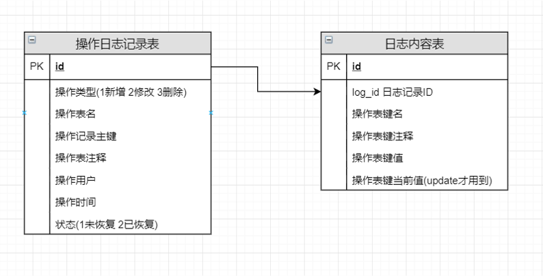
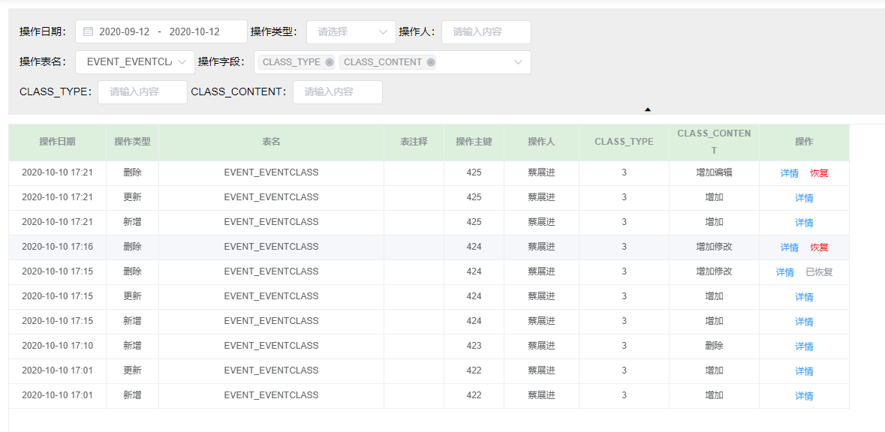
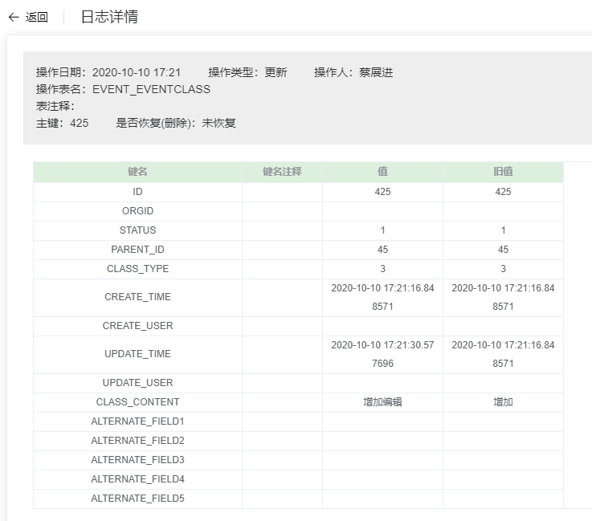

# 管理系统操作系统通用设计方案
目的为了设计操作日志的通用模块，省去创建大量附表的过程。

## 管理系统中需要记录操作日志的地方：
1. insert：在insert后，记录新增的数据
2. update：记录update前后的数据
3. delete：在delete前，记录删除前的数据

## 数据库设计


## 操作类设计
``` 
日志操作类LogOperation主要方法：
insert(table_name, table_id, operate_user_id)----新增
update_before(table_name, table_id, operate_user_id)----更新前
update_after(table_name, table_id, log_id)----更新后
delete(table_name, table_id, operate_user_id)----删除
recover_delete(log_id)----恢复删除
select_log_info(log_id)----获取某log详情
```
[LogOperation.py代码](./log_operation/log_util.py)

## 管理界面设计
要求：
1. 支持指定表检索
2. 支持表某个字段检索
3. 能恢复删除记录

#### 台账主界面：


#### LOG详情界面：
